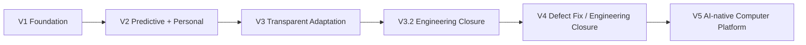

# Product Evolution

版本不是文档目录，而是能力演进：

```mermaid
flowchart LR
    V1[V1 Foundation]
    V2[V2 Predictive + Personal]
    V3[V3 Transparent Adaptation]
    V32[V3.2 Engineering Closure]
    V4[V4 Defect Fix / Engineering Closure]
    V5[V5 AI-native Computer Platform]
    V1 --> V2 --> V3 --> V32 --> V4 --> V5
```

所有版本共享同一 `docs/` 架构基线；当前状态以工程状态与验证记录为准，未来目标通过独立规划材料维护。
