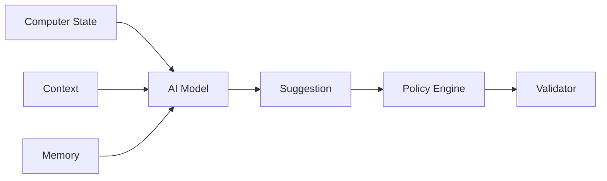

[英文](AI_ARCHITECTURE.md) | [中文](AI_ARCHITECTURE.zh-CN.md)

# AI 架构

```mermaid
flowchart LR
    STATE[Computer State]
    CONTEXT[Context]
    MEMORY[Memory]
    MODEL[AI Model]
    SUGGEST[Suggestion]
    POLICY[Policy Engine]
    VALIDATE[Validator]

    STATE --> MODEL
    CONTEXT --> MODEL
    MEMORY --> MODEL
    MODEL --> SUGGEST
    SUGGEST --> POLICY
    POLICY --> VALIDATE
```

AI 模型应通过可替换的提供者和运行时接入，不能成为核心层的硬依赖。

## 模型类别

- 确定性规则
- 轻量级本地特征模型
- SLM/LLM
- ONNX 模型
- 厂商加速模型

AI 不负责最终执行授权。
