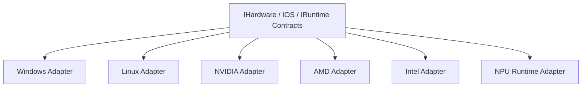

# Adapter Plane

Adapter 是平台/硬件差异的唯一归属层。

```mermaid
flowchart TB
    CONTRACT[IHardware / IOS / IRuntime Contracts]
    WIN[Windows Adapter]
    LIN[Linux Adapter]
    NVIDIA[NVIDIA Adapter]
    AMD[AMD Adapter]
    INTEL[Intel Adapter]
    NPU[NPU Runtime Adapter]

    CONTRACT --> WIN
    CONTRACT --> LIN
    CONTRACT --> NVIDIA
    CONTRACT --> AMD
    CONTRACT --> INTEL
    CONTRACT --> NPU
```

Adapter 不包含 Policy，不负责历史数据，不持有 UI 状态。
