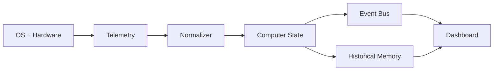

# Data Plane

```mermaid
flowchart LR
    OS[OS + Hardware]
    TEL[Telemetry]
    NORM[Normalizer]
    STATE[Computer State]
    EVENTS[Event Bus]
    DASH[Dashboard]
    MEM[Historical Memory]

    OS --> TEL --> NORM --> STATE
    STATE --> EVENTS
    EVENTS --> DASH
    STATE --> MEM
    MEM --> DASH
```

Data Plane 必须保证：

- Terminal、Web Dashboard 使用同一状态源。
- Realtime State 与 Historical Data 分离。
- UI 不直接访问 OS。
- 高频数据不得阻塞 Control Plane。
