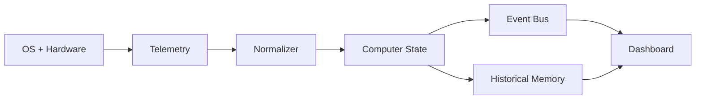

[英文](DATA_PLANE.md) | [中文](DATA_PLANE.zh-CN.md)

# 数据平面

```mermaid
flowchart LR
    OS[OS + Hardware]
    TEL[Telemetry]
    NORM[Normalizer]
    STATE[Computer State]
    EVENTS[Event Bus]
    DASH[Dashboard]
    MEM[Historical Memory]

    OS --> TEL --> NORM --> STATE
    STATE --> EVENTS
    EVENTS --> DASH
    STATE --> MEM
    MEM --> DASH
```

数据平面必须保证：

- 终端和网页仪表盘使用同一状态源。
- 实时状态与历史数据分离。
- UI 不直接访问 OS。
- 高频数据不得阻塞控制平面。
