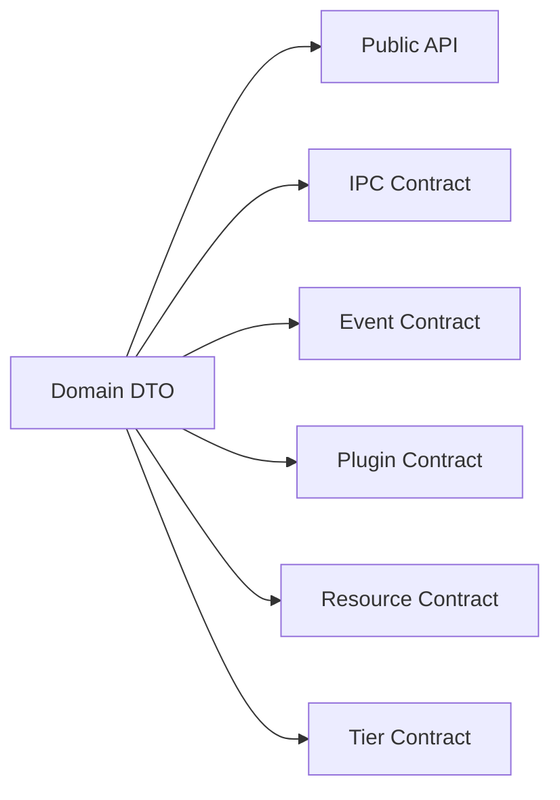

[英文](CONTRACT_ARCHITECTURE.md) | [中文](CONTRACT_ARCHITECTURE.zh-CN.md)

# 契约架构

契约是整个系统的长期边界。

```mermaid
flowchart LR
    DOMAIN[Domain DTO]
    API[Public API]
    IPC[IPC Contract]
    EVENT[Event Contract]
    PLUGIN[Plugin Contract]
    RESOURCE[Resource Contract]
    TIER[Tier Contract]

    DOMAIN --> API
    DOMAIN --> IPC
    DOMAIN --> EVENT
    DOMAIN --> PLUGIN
    DOMAIN --> RESOURCE
    DOMAIN --> TIER
```

## 规则

- 一个统一的错误模型。
- 一个统一的模式版本模型。
- 跨模块时间统一 `unix_ms`。
- 不为同一业务语义维护多个重复结构。
- 契约改动必须经过兼容性审查和契约测试。
