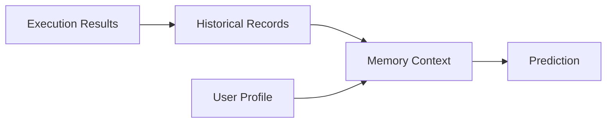

# Memory Architecture

```mermaid
flowchart LR
    EXEC[Execution Results]
    RECORD[Historical Records]
    PROFILE[User Profile]
    CONTEXT[Memory Context]
    PRED[Prediction]

    EXEC --> RECORD
    RECORD --> CONTEXT
    PROFILE --> CONTEXT
    CONTEXT --> PRED
```

Memory 分为 Realtime、Historical、User Profile、AI Effectiveness 四类。

Realtime 不长期保存；Historical 必须受 retention policy 管理。
