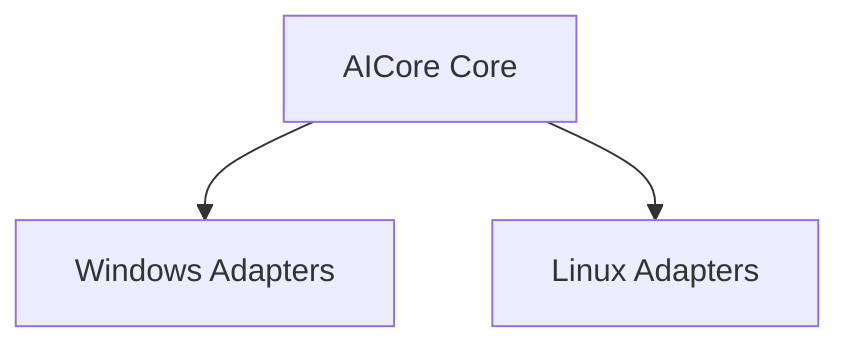

# Platform Architecture

首期平台：Windows、Linux。macOS 暂不纳入当前产品边界。

```mermaid
flowchart TB
    CORE[AICore Core]
    WIN[Windows Adapters]
    LIN[Linux Adapters]
    CORE --> WIN
    CORE --> LIN
```

核心逻辑相同；平台实现只存在于 Adapter/Runtime 层。
