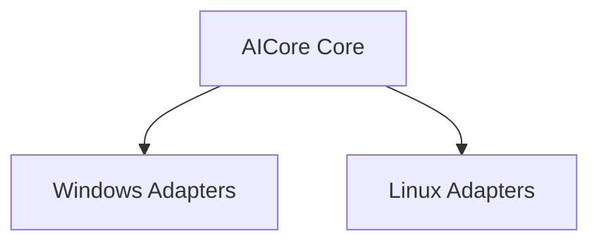

[英文](PLATFORM_ARCHITECTURE.md) | [中文](PLATFORM_ARCHITECTURE.zh-CN.md)

# 平台架构

首期平台：Windows、Linux。macOS 暂不纳入当前产品边界。

```mermaid
flowchart TB
    CORE[AICore Core]
    WIN[Windows Adapters]
    LIN[Linux Adapters]
    CORE --> WIN
    CORE --> LIN
```

核心逻辑保持一致；平台差异仅存在于适配器和运行时层。
