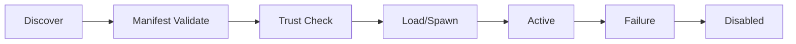

# Plugin Architecture

```mermaid
flowchart LR
    DISCOVER[Discover]
    MANIFEST[Manifest Validate]
    TRUST[Trust Check]
    LOAD[Load/Spawn]
    ACTIVE[Active]
    FAIL[Failure]
    DISABLE[Disabled]

    DISCOVER --> MANIFEST --> TRUST --> LOAD --> ACTIVE
    ACTIVE --> FAIL --> DISABLE
```

Plugin 是黑盒；Core 只能访问 Plugin API 与 capability。
