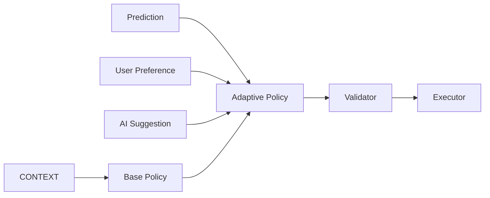

# Policy System

Policy 由 Context、Prediction、User Preference 和 AI Suggestion 共同决定。

```mermaid
flowchart LR
    CONTEXT --> BASE[Base Policy]
    PRED[Prediction] --> ADAPT[Adaptive Policy]
    USER[User Preference] --> ADAPT
    AI[AI Suggestion] --> ADAPT
    BASE --> ADAPT
    ADAPT --> VALIDATE[Validator]
    VALIDATE --> EXECUTE[Executor]
```

Policy 本身不执行系统调用。
