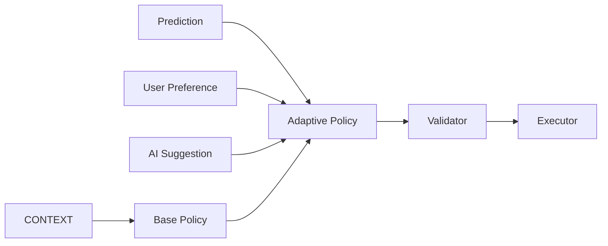

[英文](POLICY_SYSTEM.md) | [中文](POLICY_SYSTEM.zh-CN.md)

# 策略系统

策略由上下文、预测、用户偏好和 AI 建议共同决定。

```mermaid
flowchart LR
    CONTEXT --> BASE[Base Policy]
    PRED[Prediction] --> ADAPT[Adaptive Policy]
    USER[User Preference] --> ADAPT
    AI[AI Suggestion] --> ADAPT
    BASE --> ADAPT
    ADAPT --> VALIDATE[Validator]
    VALIDATE --> EXECUTE[Executor]
```

策略本身不执行系统调用。
