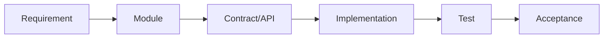

# Requirement Traceability

```mermaid
flowchart LR
    REQ[Requirement]
    MOD[Module]
    API[Contract/API]
    CODE[Implementation]
    TEST[Test]
    ACCEPT[Acceptance]

    REQ --> MOD --> API --> CODE --> TEST --> ACCEPT
```

每个 FR/NFR 都必须能追踪到至少一个实现入口和一个测试/验收证据。
