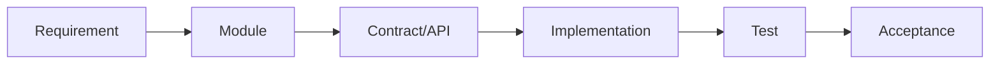

[英文](TRACEABILITY.md) | [中文](TRACEABILITY.zh-CN.md)

# 需求可追溯性

```mermaid
flowchart LR
    REQ[Requirement]
    MOD[Module]
    API[Contract/API]
    CODE[Implementation]
    TEST[Test]
    ACCEPT[Acceptance]

    REQ --> MOD --> API --> CODE --> TEST --> ACCEPT
```

每项功能或非功能需求都必须能追踪到至少一个实现入口和一项测试或验收证据。
