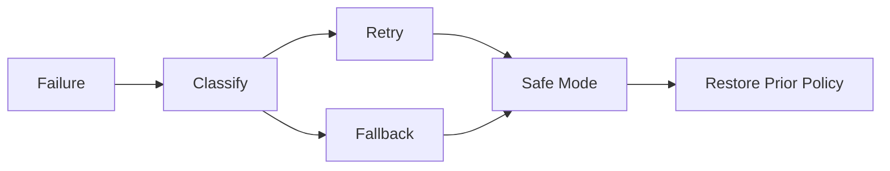

# Failure Recovery

原则：

> AICore 可以失败，但操作系统不能因为 AICore 失败而失败。

```mermaid
flowchart LR
    FAIL[Failure]
    CLASSIFY[Classify]
    RETRY[Retry]
    FALLBACK[Fallback]
    SAFE[Safe Mode]
    RESTORE[Restore Prior Policy]

    FAIL --> CLASSIFY
    CLASSIFY --> RETRY
    CLASSIFY --> FALLBACK
    RETRY --> SAFE
    FALLBACK --> SAFE
    SAFE --> RESTORE
```

每个失败必须记录 cause、stage、resource、retryable、final outcome。
