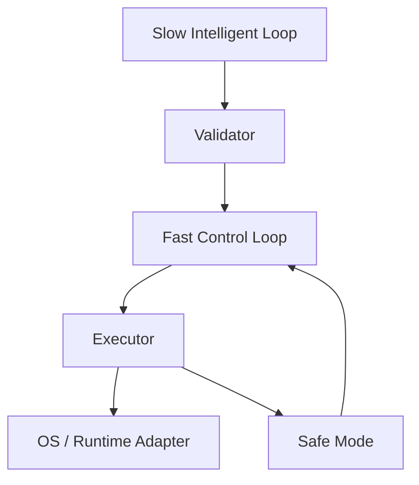

# Runtime Architecture

```mermaid
flowchart TB
    SLOW[Slow Intelligent Loop]
    FAST[Fast Control Loop]
    VALIDATE[Validator]
    EXEC[Executor]
    SAFE[Safe Mode]
    OS[OS / Runtime Adapter]

    SLOW --> VALIDATE
    VALIDATE --> FAST
    FAST --> EXEC
    EXEC --> OS
    EXEC --> SAFE
    SAFE --> FAST
```

- Slow loop：预测、上下文理解、AI。
- Fast loop：状态更新、校验、执行、回退。
- UI 不参与控制闭环。
