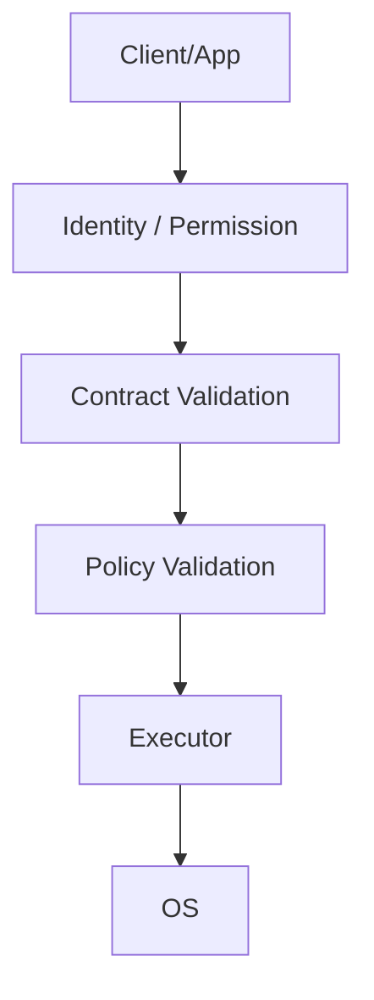

# Security Architecture

```mermaid
flowchart TB
    CLIENT[Client/App]
    AUTH[Identity / Permission]
    CONTRACT[Contract Validation]
    POLICY[Policy Validation]
    EXEC[Executor]
    OS[OS]

    CLIENT --> AUTH --> CONTRACT --> POLICY --> EXEC --> OS
```

安全边界至少覆盖 IPC、Plugin、Model、Runtime、Configuration、Persistent Data。
