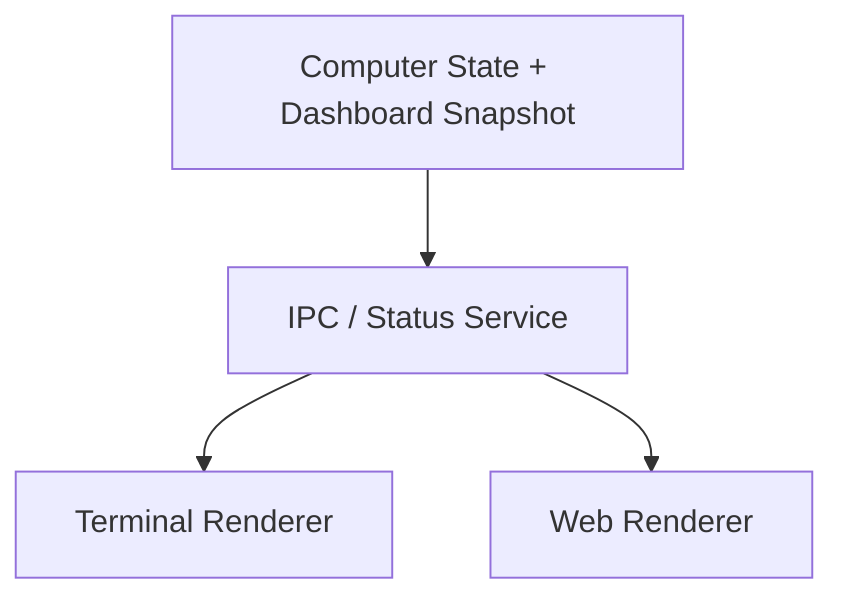

# Dashboard Architecture

Terminal 与 Web 必须是同一数据面的两个 Renderer。

```mermaid
flowchart TB
    CORE[Computer State + Dashboard Snapshot]
    IPC[IPC / Status Service]
    TUI[Terminal Renderer]
    WEB[Web Renderer]
    CORE --> IPC
    IPC --> TUI
    IPC --> WEB
```

禁止两个 UI 自己重复采集系统状态。
