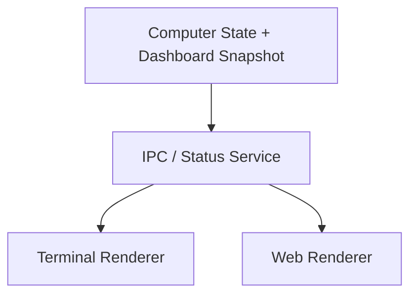

[英文](DASHBOARD_ARCHITECTURE.md) | [中文](DASHBOARD_ARCHITECTURE.zh-CN.md)

# 仪表盘架构

终端和网页必须是同一数据面的两个呈现端。

```mermaid
flowchart TB
    CORE[Computer State + Dashboard Snapshot]
    IPC[IPC / Status Service]
    TUI[Terminal Renderer]
    WEB[Web Renderer]
    CORE --> IPC
    IPC --> TUI
    IPC --> WEB
```

禁止两个界面各自重复采集系统状态。
